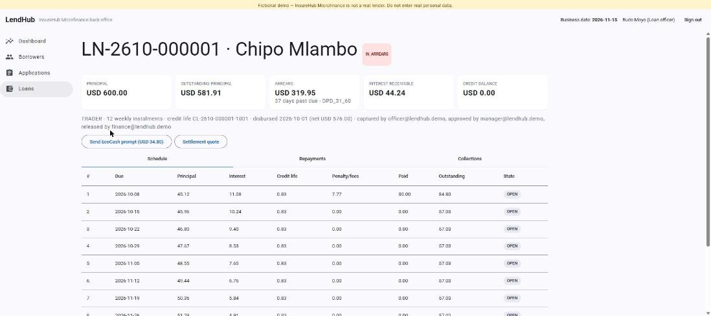

# LendHub — microfinance loan management system


**Status:** ✅ v0.1.0 built and tested (2026-10-01) · live demo: *pending deploy* · **Stack rotation slot:** Java
**Stack:** Java 21 · Spring Boot 3.3 · Spring Modulith · Spring Data JPA + Hibernate Envers · Flyway · PostgreSQL 16 · Spring Batch · Spring Security (OAuth2 resource server) · Spring AMQP (RabbitMQ) · springdoc-openapi · Micrometer + OpenTelemetry · Angular 18 (standalone, signals, Angular Material) · JUnit 5 · jqwik · Testcontainers · ArchUnit · PIT · GitHub Actions · Jib · Kustomize

**Author:** Simbarashe Nyamusa, Senior Software Engineer

LendHub is the core lending system of **InsureHub Microfinance**, the fictional lending arm of InsureHub Group. It takes a loan from application to closure: **origination, credit scoring, maker-checker approval, credit life cover, disbursement to EcoCash, amortisation (flat and reducing balance), repayments by mobile money and payroll deduction, arrears ageing (PAR 30/60/90), IFRS 9 staging, collections and a double-entry ledger**, with a restartable end-of-day batch like a real bank's.

> Fictional company. Rates, fees and regulatory treatments are illustrative, loosely modelled on the Zimbabwean market.



## Run it

```bash
docker compose up --build           # PostgreSQL, RabbitMQ, API :8080, web :4200
python scripts/smoke_test.py        # walks the whole demo journey, incl. a 45-day EOD fast-forward
```
- Back office: http://localhost:4200 (all demo users: password `Demo123!`)
- API docs: http://localhost:8080/swagger-ui.html
- RabbitMQ: http://localhost:15672 (guest/guest), see `insurehub.events`

Developing without Docker for the app: `docker compose up -d postgres`, then `./gradlew :api:bootRun` and `cd web && npm start`.

## Demo accounts

| User | Role | Scenario |
|---|---|---|
| `officer@lendhub.demo` | Loan officer (Mbare) | register a trader, capture and submit an application, enter the borrower's OTP |
| `manager@lendhub.demo` | Branch manager | approve up to US$1,000 in own branch (maker-checker) |
| `committee@lendhub.demo` | Credit committee | approve above US$1,000 / grade E; restructures and write-offs |
| `finance@lendhub.demo`, `finance2@…` | Finance | release disbursements, record receipts, payroll files, run EOD, ledger |
| `collections@lendhub.demo` | Collections | worklist, promises to pay, request restructures |
| `auditor@lendhub.demo` | Auditor | read-only, audit trail |
| `channel@lendhub.demo` | Channel service | API only: InsureAssist MCP tools and USSD |

**Two-minute demo:** officer captures a US$600 weekly Trader loan → manager approves (offer shows EIR) → officer enters the OTP → finance disburses (credit life policy appears) → *Send EcoCash prompt* → finance runs EOD for 45 days → the loan is 37 DPD, Stage 2, with CALL and VISIT tasks, and the trial balance still balances.

## What's inside

| Area | Highlights |
|---|---|
| Money maths | `BigDecimal` `Money` value object; schedules balance to the cent (property-tested); EIR by Newton–Raphson; daily accrual that sums exactly to scheduled interest; in duplum cap |
| Architecture | modular monolith, 12 Modulith modules, ports for InsureHub / Payments / bureau with simulated adapters ([module diagram](docs/modules/components.puml)) |
| Integrity | maker-checker in the domain, append-only decisions and journals, Envers audit with user, unique provider references, restartable EOD with one run per date |
| Integration | Integrations-compatible HMAC callbacks and bus envelope; outbox via the Modulith publication registry; channel endpoints for InsureAssist and USSD |
| Quality | 77 API tests (golden cases, jqwik, ArchUnit, Testcontainers journeys) + 6 web tests; PIT mutation testing in CI |

## Documentation (the full lifecycle)

| Stage | Document |
|---|---|
| Business case | [docs/01-concept-paper.md](docs/01-concept-paper.md) |
| Requirements | [docs/02-requirements.md](docs/02-requirements.md) |
| Design | [docs/03-architecture.md](docs/03-architecture.md), [docs/adr/](docs/adr/), [docs/modules/](docs/modules/) (generated from code) |
| Security & compliance | [docs/04-security-and-compliance.md](docs/04-security-and-compliance.md) |
| Testing | [docs/05-test-strategy.md](docs/05-test-strategy.md) |
| Delivery | [docs/06-delivery-plan.md](docs/06-delivery-plan.md), [CHANGELOG.md](CHANGELOG.md) |
| Verification | [docs/07-traceability.md](docs/07-traceability.md) — every requirement → code → test, deviations, backlog |
| Operations | [docs/08-operations.md](docs/08-operations.md) — EOD failures, payments, outbox, data-protection requests |

## Repo layout

```
lendhub/
├── api/                         Spring Boot app (Gradle Kotlin DSL)
│   └── src/main/java/zw/insurehub/lendhub/
│       ├── borrowers/  products/  origination/  scoring/  loans/  repayments/
│       ├── collections/  ledger/  provisioning/  eod/  reporting/  integration/
│       └── shared/                  Money, security, crypto, errors (ProblemDetails)
├── web/                         Angular 18 back office
├── deploy/                      Kustomize base + demo overlay (ArgoCD, insurehub-platform)
├── scripts/smoke_test.py        post-deploy journey test
└── docs/
```

## Ecosystem

Repayments arrive from **InsureHub Integrations** (Payments hub), every loan gets **credit life** cover from **InsureHub**, and `loan.*` events feed Notifications. **InsureAssist** and **InsureHub USSD** use the channel endpoints (`/customers?msisdn=`, `/customers/{ref}/loans`, `/loans/{id}/repayment-requests`). See `insurehub-platform/docs/ecosystem-architecture.md`.
