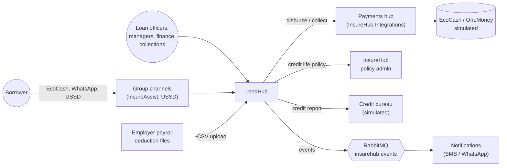
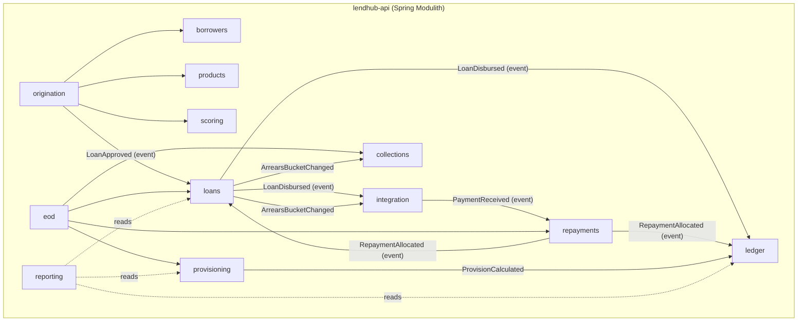
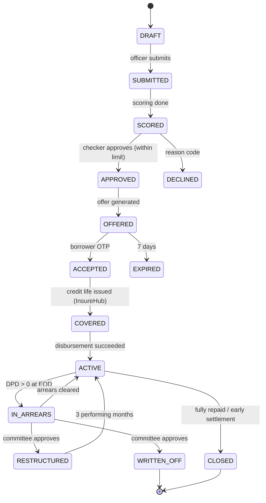
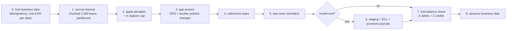
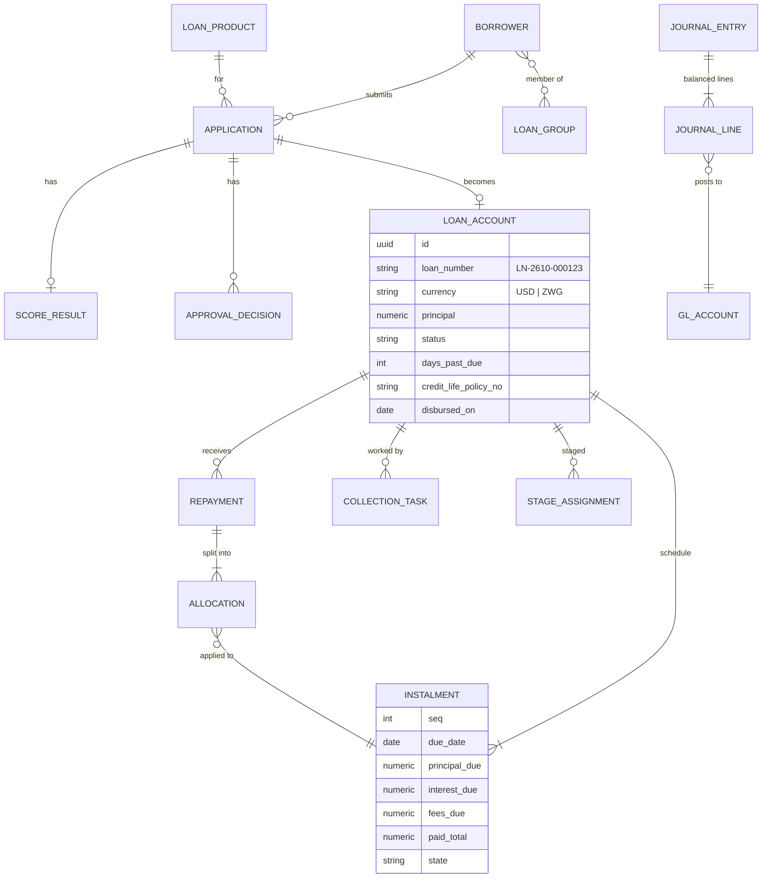

# LendHub — architecture

## 1. Context (C4 level 1)



## 2. Containers (C4 level 2)

| Container | Tech | Responsibility |
|---|---|---|
| `lendhub-web` | Angular, Angular Material, signals, ECharts | back office for all staff personas |
| `lendhub-api` | Spring Boot 3, Java 21 (virtual threads on), Spring Modulith | all business modules, REST API, EOD batch |
| PostgreSQL | 16 | `lendhub` database: module-owned schemas, Flyway migrations, Envers audit tables, Modulith `event_publication` table |
| RabbitMQ | shared group broker | externalised events; consumes `payment.succeeded` for `LN-` references |

A **modular monolith** (ADR-0001): one deployable with strict internal module boundaries verified by Spring Modulith and ArchUnit. Modules talk via application events or published interfaces (`api` packages) only.

## 3. Modules (C4 level 3)



| Module | Owns | Publishes | Listens to |
|---|---|---|---|
| borrowers | Borrower, Group, KycDocument, Consent | — | — |
| products | LoanProduct, PricingParameters, HolidayCalendar | — | — |
| origination | Application, AffordabilityAssessment, ApprovalDecision, Offer | `ApplicationSubmitted`, `LoanApproved` | — |
| scoring | Scorecard, ScoreResult (with reasons), BureauReport | `ApplicationScored` | `ApplicationSubmitted` |
| loans | LoanAccount, RepaymentSchedule, Instalment, Restructure | `LoanDisbursed`, `ArrearsBucketChanged`, `LoanClosed` | `LoanApproved`, `RepaymentAllocated` |
| repayments | Repayment, Allocation, PayrollBatch, Reversal | `RepaymentAllocated` | `PaymentReceived` |
| collections | CollectionTask, PromiseToPay | — | `ArrearsBucketChanged` |
| ledger | Account (chart of accounts), JournalEntry, JournalLine | — | `LoanDisbursed`, `RepaymentAllocated`, `InterestAccrued`, `ProvisionCalculated` |
| provisioning | StageAssignment, EclParameters, ProvisionRun | `ProvisionCalculated` | — (called by EOD month-end) |
| eod | BusinessDate, EodRun (Spring Batch metadata) | `InterestAccrued` | — |
| reporting | read models / SQL views | — | — |
| integration | outbound clients (Payments, InsureHub, bureau), inbound AMQP listener, event externalisation config | `loan.*` to RabbitMQ | `payment.succeeded` from RabbitMQ |

## 4. Loan state machine



Transitions are methods on the `LoanAccount` aggregate that enforce guards (e.g. no disbursement without `creditLifePolicyNumber`), so illegal transitions are impossible, not just discouraged — the same approach as InsureHub's `ClaimWorkflow`.

## 5. Calculations

### Flat rate (Salary Advance)
```
totalInterest   = P × r_month × n
instalment      = round2((P + totalInterest) / n)
last instalment = (P + totalInterest) − instalment × (n − 1)     // absorbs rounding
principal part  = round2(P / n), last absorbs difference
```

### Reducing balance (Trader, Group) — equal instalments
```
i          = periodic rate (monthly r, or weekly r × 12 / 52)
instalment = round2( P × i / (1 − (1 + i)^−n) )
interest_k = round2( outstanding_(k−1) × i )
principal_k= instalment − interest_k
last       : principal_n = outstanding_(n−1); instalment_n = principal_n + interest_n
```
Computed with `BigDecimal` and `MathContext.DECIMAL128` for intermediate values; rounding only at the stored amount (ADR-0002).

### Effective annual rate disclosure
IRR of the cash flows (−net disbursed at t0, +instalments incl. fees and credit life at each due date), solved with Newton–Raphson, annualised: `EIR = (1 + irr_period)^(periods per year) − 1`. Shown on the offer because the Microfinance Act requires full disclosure of cost ([source](https://zimlii.org/akn/zw/act/2013/3/eng@2019-11-19/source.pdf)).

### Allocation (LH-42)
Waterfall over instalments oldest-first: penalties → fees → credit-life premium → interest → principal. Implemented as a pure function `allocate(Money amount, List<InstalmentDue> dues, AllocationOrder order) → List<AllocationLine>` — trivially property-testable.

### In duplum cap (LH-51)
`accruedArrearInterest + penaltiesSinceDefault ≤ outstandingPrincipal`; accrual stops once reached and resumes only if the balance changes. Illustrative implementation of the common-law rule ([source](https://allafrica.com/stories/200411110586.html)); configurable per product so compliance can adjust it.

### IFRS 9 staging & ECL (LH-70/71)
Stage from DPD using the standard's rebuttable presumptions (> 30 DPD → Stage 2, > 90 DPD → Stage 3) ([source](https://www.pwc.com/hu/hu/szolgaltatasok/ifrs/ifrs_9/ifrs9_kiadvanyok/ifrs_9_expected_credit_losses.pdf)); restructured loans at least Stage 2. `ECL = PD(stage, product) × LGD(product) × EAD` with illustrative, configurable parameters — the point is the mechanics and journals, not a validated risk model.

## 6. End-of-day batch (Spring Batch)



- `JpaPagingItemReader` / `JdbcCursorItemReader` + partitioning by loan-ID ranges; `JdbcBatchItemWriter` for accrual rows.
- Restartable (Spring Batch job repository); a failed step resumes from the last committed chunk.
- Performance target: 1M instalment rows in < 15 min on 2 OCPU (NFR); measured and published in the README.
- Scheduled as a Kubernetes `CronJob` at 00:30 Africa/Harare (or triggered from the finance UI in the demo).

## 7. Data model (core)



Indexing plan (shows the SQL tuning claim): partial index on `loan_account(status) WHERE status IN ('ACTIVE','IN_ARREARS')`; `instalment(loan_id, due_date)`; `instalment(due_date) WHERE state <> 'PAID'` for EOD; `repayment(provider_reference) UNIQUE` for idempotency; BRIN on `journal_line(posted_at)` for large append-only tables. `EXPLAIN ANALYZE` results for the EOD queries are recorded in `docs/perf/`.

## 8. API (v1, OpenAPI via springdoc)

| Method | Path | Role |
|---|---|---|
| POST/GET | `/api/v1/borrowers`, `/api/v1/borrowers/{id}` | OFFICER |
| POST | `/api/v1/groups` | OFFICER |
| POST | `/api/v1/applications` · `/{id}/submit` | OFFICER |
| POST | `/api/v1/applications/{id}/decisions` | MANAGER / COMMITTEE (maker ≠ checker) |
| POST | `/api/v1/applications/{id}/offer/accept` | borrower via OTP |
| POST | `/api/v1/loans/{id}/disburse` | FINANCE |
| GET | `/api/v1/loans/{id}` · `/schedule` · `/statement` | staff; borrower (own) via channel token |
| GET | `/api/v1/loans/{id}/settlement-quote?asOf=` | staff, channels |
| POST | `/api/v1/loans/{id}/repayment-requests` | channels (starts EcoCash payment via Payments; `Idempotency-Key`) |
| POST | `/api/v1/integrations/payments` | Payments hub (HMAC-signed callback) |
| POST | `/api/v1/payroll-batches` (CSV) | FINANCE |
| POST | `/api/v1/loans/{id}/restructure` · `/write-off` | COMMITTEE |
| GET | `/api/v1/collections/tasks?mine=true` | COLLECTIONS |
| POST | `/api/v1/eod/runs` | FINANCE |
| GET | `/api/v1/reports/par` · `/portfolio` · `/trial-balance` · `/regulatory-return` | MANAGER, FINANCE, AUDITOR |
| GET | `/api/v1/customers/{customerRef}/loans` | channels (InsureAssist MCP, USSD) |

Errors: RFC 7807 ProblemDetails (`type`, `title`, `detail`, `errors[]`), same as InsureHub.

## 9. Events (externalised to `insurehub.events`)

| Routing key | Payload (data) |
|---|---|
| `loan.disbursed` | loanNumber, customerRef, currency, principal, firstDueDate |
| `loan.instalment-due` | loanNumber, customerRef, dueDate, amountDue |
| `loan.arrears-changed` | loanNumber, customerRef, dpd, fromBucket, toBucket, arrearsAmount |

Implemented with Spring Modulith's event publication registry (transactional outbox) and AMQP externalisation — compare with Integrations' hand-rolled outbox in ADR-0004 ([Spring Modulith events](https://docs.spring.io/spring-modulith/reference/events.html)).

## 10. Front end (Angular)

Feature areas as lazy-loaded standalone routes: `applications`, `loans`, `collections`, `finance` (EOD, ledger, payroll uploads), `reports`. State via signals + services; HTTP interceptors for auth and ProblemDetails → form errors; role-based route guards; Angular Material tables with server-side paging; ECharts for PAR trend and bucket waterfall.

## 11. Deployment

Jib builds multi-arch images (no Dockerfile needed) → GHCR → ArgoCD. JVM flags: `-XX:MaxRAMPercentage=75 -XX:+UseSerialGC` (small heap, 2 OCPU node) — measured, not assumed. The Angular app goes to Cloudflare Pages.
